# Workspace MCP Server

> **A lightweight Model Context Protocol (MCP) server that builds intelligent workspace capsules and exposes workspace-aware tools for enhanced AI development workflows.**

[](https://nodejs.org/)
[](https://github.com/modelcontextprotocol/typescript-sdk)
[](LICENSE)

## 🚀 Quick Start

```bash
# Install dependencies
npm install

# Generate config.json (no overwrite)
npx workspace-mcp init

# Start the MCP server
npx workspace-mcp start

# Optional: analyze workspace without writing config
npx workspace-mcp analyze --dry-run

# Development mode with auto-reload (alternative to CLI start)
npm run dev
```

## 📖 Overview

The Workspace MCP Server is an intelligent workspace analysis tool that automatically discovers, indexes, and provides semantic search capabilities across your development projects. It creates lightweight "capsules" for each application in your workspace, enabling AI assistants to understand your codebase structure and provide more contextual assistance.

### Key Features

- 🔍 **Automatic App Discovery** - Scans workspace using configurable glob patterns
- 🧠 **Intelligent Capsule Generation** - Creates structured summaries of applications
- 🔄 **Real-time File Watching** - Updates capsules when files change
- 🎯 **Activity-based Prioritization** - Promotes frequently used apps
- 🔎 **Hybrid Search** - Combines BM25 and semantic search for optimal results
- ⚡ **Rate-limited Processing** - Prevents system overload with queue management
- 🏗️ **Git-aware Indexing** - Different budgets for git vs non-git projects

## 🏗️ Architecture

### System Overview


### Data Flow


### Capsule Structure

```mermaid
%%{init: {"theme": "default", "themeVariables": {"primaryTextColor": "#111111", "secondaryTextColor": "#111111", "tertiaryTextColor": "#111111", "lineColor": "#1f2937", "fontSize": "14px"}} }%%
graph LR
    subgraph "App Capsule"
        direction TB
        
        META[Metadata<br/>• Purpose<br/>• Generated At<br/>• Token Budget]
        
        ARCH[Architecture<br/>• Key Modules<br/>• Flow Diagram<br/>• Dependencies]
        
        ENTRY[Entrypoints<br/>• Main Files<br/>• CLI Scripts<br/>• Server Files]
        
        DOCS[Documentation<br/>• README<br/>• Architecture<br/>• Runbooks]
        
        TESTS[Test Suite<br/>• Unit Tests<br/>• Integration<br/>• Hot Tests]
        
        OWNERS[Ownership<br/>• Team Info<br/>• Maintainers<br/>• Contacts]
        
        AI[AI Analysis<br/>• Role Classification<br/>• Confidence Score<br/>• Evidence Paths]
    end
    
    META --> ARCH
    ARCH --> ENTRY
    ENTRY --> DOCS
    DOCS --> TESTS
    TESTS --> OWNERS
    OWNERS --> AI
    
    style META fill:#e3f2fd,color:#111111
    style ARCH fill:#f1f8e9,color:#111111
    style ENTRY fill:#fff3e0,color:#111111
    style DOCS fill:#fce4ec,color:#111111
    style TESTS fill:#e8f5e8,color:#111111
    style OWNERS fill:#f3e5f5,color:#111111
    style AI fill:#fff8e1,color:#111111
```



## ⚙️ Configuration

### config.json Structure

```json
{
  "workspaceRoot": "/Users/ashafi/Documents/work",
  "appGlobs": [
    "ai/ai_systems/apps/*",
    "automation/dev-team-repos/*",
    "automation/qe-automation-repos/*",
    "tools/*",
    "automation/documentation/*",
    "notes/*"
  ],
  "ignore": [
    "**/node_modules/**",
    "**/.git/**",
    "**/.venv/**",
    "**/dist/**",
    "**/*.png",
    "**/*.log"
  ],
  "queue": {
    "maxConcurrentSummaries": 3,
    "summariesPerMinute": 3,
    "debounceMs": 750,
    "priorityPaths": ["/Users/ashafi/Documents/work/ai/ai_systems/apps"]
  },
  "purpose": {
    "limits": {
      "maxFiles": 25,
      "maxBytes": 350000,
      "chunkTokens": 3000,
      "timeoutMs": 8000
    },
    "gitRepoOverrides": {
      "maxFiles": 50,
      "maxBytes": 800000,
      "chunkTokens": 3800,
      "timeoutMs": 12000
    }
  },
  "activity": {
    "enable": true,
    "sources": {
      "cursorIde": true,
      "cursorSessions": true,
      "fsMtime": true
    },
    "promote": {
      "minScore": 3.0,
      "maxPerRoot": 20,
      "depthLimit": 2
    }
  }
}
```

### Configuration Options

| Section | Option | Description | Default |
|---------|--------|-------------|---------|
| `workspaceRoot` | - | Root directory to scan | `/Users/ashafi/Documents/work` |
| `appGlobs` | - | Patterns to find applications | `["ai/ai_systems/apps/*"]` |
| `ignore` | - | Patterns to ignore during scanning | Common build/cache dirs |
| `queue.maxConcurrentSummaries` | - | Max parallel processing jobs | `3` |
| `queue.summariesPerMinute` | - | Rate limit for AI summarization | `3` |
| `queue.debounceMs` | - | Debounce window for file changes | `750` |
| `purpose.limits.maxFiles` | - | Max files to analyze per app | `25` |
| `purpose.limits.maxBytes` | - | Max bytes to process per app | `350000` |
| `activity.enable` | - | Enable activity-based promotion | `true` |
| `activity.promote.minScore` | - | Min score for promotion | `3.0` |

## 🛠️ Available Tools

The server exposes the following MCP tools:

### Core Tools

| Tool | Description | Parameters |
|------|-------------|------------|
| `workspace.list_roots` | List discovered app root directories | None |
| `workspace.list_apps` | List indexed applications | None |
| `workspace.find_app` | Fuzzy search for apps by name | `name`, `limit` |
| `workspace.bootstrap` | Build/refresh capsule for an app | `app`, `force`, `intent` |

### Analysis Tools

| Tool | Description | Parameters |
|------|-------------|------------|
| `workspace.list_entrypoints` | Get detected entrypoints for an app | `app` |
| `workspace.describe_symbol` | Get file head and top-level definitions | `path` |
| `workspace.tests_for` | List hot tests for an app | `app` |
| `workspace.owners` | Get ownership information | `path` |

### Search Tools

| Tool | Description | Parameters |
|------|-------------|------------|
| `workspace.search_semantic` | Hybrid semantic + BM25 search | `query`, `app`, `top_k`, `min_score`, `mode` |

### Search Modes

- **`hybrid`** (default): Combines BM25 and semantic similarity (70% semantic + 30% BM25)
- **`bm25`**: Pure keyword-based search using BM25 algorithm
- **`semantic`**: Pure semantic similarity using embeddings

## 🔄 Queue Management

### Processing Pipeline

```mermaid
%%{init: {"theme": "default", "themeVariables": {"primaryTextColor": "#111111", "secondaryTextColor": "#111111", "tertiaryTextColor": "#111111", "lineColor": "#1f2937", "fontSize": "14px"}} }%%
graph LR
    subgraph "Job Queue System"
        direction LR
        
        TRIGGER[File Changes<br/>Activity<br/>Startup]
        
        DEBOUNCE[Debounce<br/>750ms window]
        
        QUEUE[Priority Queue<br/>• Priority 1: Priority paths<br/>• Priority 2: Standard<br/>• FIFO within priority]
        
        RATE[Rate Limiter<br/>• 3 jobs/minute<br/>• 3 concurrent max]
        
        PROCESS[Processing<br/>• Git detection<br/>• Metadata creation<br/>• AI summarization<br/>• Capsule caching]
        
        TRIGGER --> DEBOUNCE
        DEBOUNCE --> QUEUE
        QUEUE --> RATE
        RATE --> PROCESS
    end
    
    style TRIGGER fill:#ffecb3,color:#111111
    style DEBOUNCE fill:#e1f5fe,color:#111111
    style QUEUE fill:#f3e5f5,color:#111111
    style RATE fill:#fff3e0,color:#111111
    style PROCESS fill:#e8f5e8,color:#111111
```



### Activity-based Promotion

The system tracks activity from multiple sources to promote frequently used applications:

1. **Cursor IDE State** - Currently open files and workspaces
2. **Cursor Sessions** - Historical session data
3. **File System Activity** - Recently modified files (7-day window)

Applications with activity scores above the threshold (`minScore: 3.0`) are automatically promoted for processing.

## 📁 Cache Structure

Capsules are cached in the `cache/` directory with hex-encoded filenames:

```
cache/
├── capsule_2f55736572732f...636c617564652d746573742d67656e657261746f72.json
├── capsule_2f55736572732f...6175746f6d6174696f6e2d7265706f732f6772632d7569.json
└── telemetry.log
```

Each capsule contains:
- Application metadata and purpose
- Architecture overview with key modules
- Detected entrypoints and documentation
- Test suite information
- AI analysis results

## 🧪 Testing

### CLI Quick Checks

Use the CLI to exercise tools through the MCP server:

```bash
# List tools from your MCP client or connect and call via your environment
# (Client wiring varies; see Cursor MCP settings to add the binary: node /ABS/PATH/tools/workspace-mcp/index.js)
```

### Debug Bootstrap

For debugging capsule generation:

```bash
node debug-bootstrap.js [app-path]
```

## 🔍 Search Examples

### Basic Search
```javascript
// Find authentication-related code
{
  "method": "tools/call",
  "params": {
    "name": "workspace.search_semantic",
    "arguments": {
      "query": "user authentication login",
      "mode": "hybrid",
      "top_k": 10
    }
  }
}
```

### App-specific Search
```javascript
// Search within a specific application
{
  "method": "tools/call",
  "params": {
    "name": "workspace.search_semantic",
    "arguments": {
      "query": "MCP protocol implementation",
      "app": "/Users/ashafi/Documents/work/ai/ai_systems/apps/claude-test-generator",
      "mode": "semantic",
      "top_k": 5
    }
  }
}
```

## 📊 Performance Characteristics

### Indexing Performance

- **Cold Start**: ~2-3 seconds for 50 applications
- **Incremental Updates**: ~100-500ms per application
- **Memory Usage**: ~50-100MB for typical workspace
- **Cache Hit Rate**: >90% for stable codebases

### Search Performance

- **Hybrid Search**: ~100-300ms per query
- **BM25 Only**: ~50-100ms per query
- **Semantic Only**: ~200-500ms per query (includes embedding)

## 🛡️ Security & Privacy

- **Workspace Boundaries**: All operations are restricted to configured workspace root
- **No External Calls**: AI summarization is currently stubbed (no external API calls)
- **Local Processing**: All indexing and search happens locally
- **File Access**: Read-only access to workspace files

## 🔧 Development

### Project Structure

```
workspace-mcp/
├── index.js              # Main MCP server implementation
├── cli.js                # npx-style CLI (init/start/analyze --dry-run)
├── config.json           # Workspace configuration (user-specific)
├── package.json          # Node.js dependencies and bin entry
├── debug-bootstrap.js    # Optional: capsule generator for a single app
├── cache/               # Capsule cache directory
│   ├── capsule_*.json   # Individual app capsules
│   └── telemetry.log    # Usage telemetry
└── README.md           # This file
```

### Key Dependencies

- **[@modelcontextprotocol/sdk](https://github.com/modelcontextprotocol/typescript-sdk)**: MCP protocol implementation
- **[@xenova/transformers](https://github.com/xenova/transformers.js)**: Local ML embeddings
- **[chokidar](https://github.com/paulmillr/chokidar)**: File system watching
- **[fast-glob](https://github.com/mrmlnc/fast-glob)**: High-performance file globbing
- **[fuse.js](https://fusejs.io/)**: Fuzzy search for app discovery
- **[lunr](https://lunrjs.com/)**: Full-text search indexing

### Contributing

1. Fork the repository
2. Create a feature branch
3. Make your changes
4. Test with `node test_harness.cjs`
5. Submit a pull request

## 📈 Roadmap

- [ ] **Enhanced AI Summarization** - Integration with external LLM APIs
- [ ] **Real-time Collaboration** - Multi-user workspace support  
- [ ] **Advanced Analytics** - Usage patterns and code quality metrics
- [ ] **Plugin System** - Custom analyzers and extractors
- [ ] **Web Interface** - Browser-based workspace exploration
- [ ] **Integration APIs** - Webhooks and external system connectors

## 📄 License

This project is licensed under the ISC License - see the [LICENSE](LICENSE) file for details.

## 🤝 Support

For questions, issues, or contributions:

1. Check existing [Issues](../../issues)
2. Create a new issue with detailed information
3. Join the discussion in [Discussions](../../discussions)

---

<div align="center">

**Built with ❤️ for enhanced AI-assisted development workflows**

[Documentation](docs/) • [Examples](examples/) • [Contributing](CONTRIBUTING.md)

</div>
