# 🧠 Workspace MCP Server

<div align="center">

**Intelligent workspace analysis server with AI-powered indexing and semantic search capabilities**

[](https://nodejs.org/)
[](https://github.com/modelcontextprotocol/typescript-sdk)
[](https://ai.google.dev/)
[](LICENSE)

</div>

---

## ✨ What Makes This Special

🧠 **AI-Powered Intelligence** • Automatically understands your codebase structure and purpose  
⚡ **Zero Configuration** • Smart workspace detection with one command setup  
🔍 **Hybrid Search** • Combines keyword + semantic search for precise results  
🏗️ **Intelligent Caching** • Builds lightweight "capsules" for lightning-fast queries  
🎯 **Activity-Aware** • Prioritizes your most-used projects automatically  
🔒 **Privacy-First** • Local processing with configurable AI integration

## 🚀 Quick Start

<div align="center">

**Three commands to set up workspace analysis:**

</div>

```bash
# 1️⃣ Clone and install
git clone https://github.com/YOUR_USERNAME/workspace-mcp.git
cd workspace-mcp && npm install

# 2️⃣ Smart auto-configuration (detects your workspace structure)
npx workspace-mcp init

# 3️⃣ Start the intelligent MCP server
npx workspace-mcp start
```

<details>
<summary>🔧 <strong>Advanced Options</strong></summary>

```bash
# Preview configuration without writing
npx workspace-mcp analyze --dry-run

# Development mode with auto-reload
npm run dev

# Test AI integration
node test_ai.js

# Override workspace root
WORKSPACE_MCP_ROOT=/custom/path npx workspace-mcp init
```

</details>

## 📖 Overview

This MCP server provides intelligent workspace analysis through configurable project discovery, AI-powered summarization, and semantic search capabilities. It creates structured metadata for each discovered application, enabling efficient code understanding and contextual search.

### 📁 App Discovery

An **"app"** is any directory matching your `appGlobs` configuration patterns. See [WORKFLOW_AND_TOOLS.md](WORKFLOW_AND_TOOLS.md#-app-discovery-what-constitutes-an-app) for detailed discovery logic and examples.

### 🎯 The Problem It Solves

Traditional code search is limited to exact text matching. When you ask "Where is user authentication handled?" or "How does the payment flow work?", you end up manually searching through dozens of files. 

**This server addresses that limitation** by providing semantic understanding of codebases, enabling conceptual queries with precise, targeted results.

### 🧠 How It Works

```mermaid
flowchart LR
    A["📁 Your Workspace"] --> B["🧠 AI Analysis"]
    B --> C["📦 Smart Capsules"]
    C --> D["⚡ Instant Search"]
    
    classDef workspace fill:#e3f2fd,stroke:#333,stroke-width:2px,color:#000
    classDef ai fill:#fff3e0,stroke:#333,stroke-width:2px,color:#000
    classDef capsule fill:#f3e5f5,stroke:#333,stroke-width:2px,color:#000
    classDef search fill:#e8f5e8,stroke:#333,stroke-width:2px,color:#000

    class A workspace
    class B ai
    class C capsule
    class D search
```



1. **🔍 Discovers** your projects automatically using smart glob patterns
2. **🧠 Analyzes** each app with AI to understand its purpose and structure  
3. **📦 Creates** lightweight "capsules" with metadata, docs, tests, and entrypoints
4. **⚡ Serves** lightning-fast semantic search through MCP protocol

## 🌟 Key Features

<table>
<tr>
<td width="50%">

### 🧠 **AI-Powered Analysis**
- **Smart Purpose Detection** using Gemini/OpenAI
- **Automatic Code Understanding** 
- **Intelligent Project Classification**
- **Context-Aware Summarization**

### ⚡ **Lightning Performance**
- **Intelligent Caching System**
- **Hybrid Search (BM25 + Semantic)**
- **Activity-Based Prioritization**
- **Real-time File Watching**

</td>
<td width="50%">

### 🎯 **Zero-Config Setup**
- **Auto-Workspace Detection**
- **Smart Glob Pattern Suggestions**
- **Git-Aware Processing**
- **One-Command Installation**

### 🔒 **Privacy & Security**
- **Local-First Processing**
- **Workspace Boundary Protection**
- **Configurable AI Integration**
- **No Data Lock-in**

</td>
</tr>
</table>

## 🏗️ Architecture

### System Overview


### Data Flow

```mermaid
sequenceDiagram
    participant Client as 💻 MCP Client
    participant Server as 🧠 Workspace MCP
    participant Scanner as 🔍 App Scanner
    participant Queue as 📋 Job Queue
    participant Generator as 🏭 Capsule Generator
    participant Cache as 💾 File Cache
    participant Search as 🔎 Search Engine

    Client->>Server: Initialize MCP Connection
    Server->>Scanner: Discover Apps
    Scanner->>Queue: Enqueue Apps for Processing
    
    rect rgb(240, 248, 255)
        Note over Queue,Search: Queue Processing
        loop Process Apps
            Queue->>Generator: Process App
            Generator->>Cache: Read/Write Capsule
            Generator->>Search: Build Search Index
        end
    end
    
    Client->>Server: search_semantic(query)
    Server->>Search: Hybrid Search
    Search-->>Server: Ranked Results
    Server-->>Client: Search Results
    
    Note over Server, Cache: 👁️ File watching triggers re-indexing
```



### Capsule Structure

Each app produces a structured capsule containing metadata, entrypoints, tests, documentation, and AI analysis. See [WORKFLOW_AND_TOOLS.md](WORKFLOW_AND_TOOLS.md#-capsule-metadata-the-intelligence-behind-fast-queries) for detailed capsule structure and examples.

## ⚙️ Configuration

### config.json Structure

```json
{
  "workspaceRoot": "/path/to/your/workspace",
  "appGlobs": [
    "apps/*",
    "packages/*",
    "services/*",
    "tools/*",
    "documentation/*",
    "notes/*"
  ],
  "ignore": [
    "**/node_modules/**",
    "**/.git/**",
    "**/.venv/**",
    "**/dist/**",
    "**/*.png",
    "**/*.log"
  ],
  "queue": {
    "maxConcurrentSummaries": 3,
    "summariesPerMinute": 3,
    "debounceMs": 750,
    "priorityPaths": ["/path/to/your/workspace/priority/apps"]
  },
  "purpose": {
    "limits": {
      "maxFiles": 25,
      "maxBytes": 350000,
      "chunkTokens": 3000,
      "timeoutMs": 8000
    },
    "gitRepoOverrides": {
      "maxFiles": 50,
      "maxBytes": 800000,
      "chunkTokens": 3800,
      "timeoutMs": 12000
    }
  },
  "activity": {
    "enable": true,
    "sources": {
      "cursorIde": true,
      "cursorSessions": true,
      "fsMtime": true
    },
    "promote": {
      "minScore": 3.0,
      "maxPerRoot": 20,
      "depthLimit": 2
    }
  }
}
```

### Configuration Options

| Section | Option | Description | Default |
|---------|--------|-------------|---------|
| `workspaceRoot` | - | Root directory to scan | `/path/to/your/workspace` |
| `appGlobs` | - | Patterns to find applications | `["apps/*", "packages/*"]` |
| `ignore` | - | Patterns to ignore during scanning | Common build/cache dirs |
| `queue.maxConcurrentSummaries` | - | Max parallel processing jobs | `3` |
| `queue.summariesPerMinute` | - | Rate limit for AI summarization | `3` |
| `queue.debounceMs` | - | Debounce window for file changes | `750` |
| `purpose.limits.maxFiles` | - | Max files to analyze per app | `25` |
| `purpose.limits.maxBytes` | - | Max bytes to process per app | `350000` |
| `activity.enable` | - | Enable activity-based promotion | `true` |
| `activity.promote.minScore` | - | Min score for promotion | `3.0` |

### AI Summarization

AI summarization is enabled by default with Gemini → OpenAI → local fallback priority. For complete configuration options, disable instructions, and usage scenarios, see [WORKFLOW_AND_TOOLS.md](WORKFLOW_AND_TOOLS.md#-when-ai-services-are-used-vs-not-used-the-complete-guide).

## 🛠️ Available Tools

The server exposes the following MCP tools:

### Core Tools

| Tool | Description | Parameters |
|------|-------------|------------|
| `workspace.list_roots` | List discovered app root directories | None |
| `workspace.list_apps` | List indexed applications | None |
| `workspace.find_app` | Fuzzy search for apps by name | `name`, `limit` |
| `workspace.bootstrap` | Build/refresh capsule for an app | `app`, `force`, `intent` |

### Analysis Tools

| Tool | Description | Parameters |
|------|-------------|------------|
| `workspace.list_entrypoints` | Get detected entrypoints for an app | `app` |
| `workspace.describe_symbol` | Get file head and top-level definitions | `path` |
| `workspace.tests_for` | List hot tests for an app | `app` |
| `workspace.owners` | Get ownership information | `path` |

### Search Tools

| Tool | Description | Parameters |
|------|-------------|------------|
| `workspace.search_semantic` | Hybrid semantic + BM25 search | `query`, `app`, `top_k`, `min_score`, `mode` |

### Search Modes

- **`hybrid`** (default): Combines BM25 and semantic similarity (70% semantic + 30% BM25)
- **`bm25`**: Pure keyword-based search using BM25 algorithm
- **`semantic`**: Pure semantic similarity using embeddings

## 🔄 Queue Management

The system uses rate-limited job queues with activity-based promotion. For detailed queue mechanics, refresh triggers, and performance optimization, see [WORKFLOW_AND_TOOLS.md](WORKFLOW_AND_TOOLS.md#-capsule-refresh-mechanisms-when-and-how-often).

## 📁 Cache Structure

Capsules are cached in the `cache/` directory with hex-encoded filenames. See [WORKFLOW_AND_TOOLS.md](WORKFLOW_AND_TOOLS.md#caching--persistence) for detailed caching mechanisms and cache hit/miss performance analysis.

## 🧪 Testing

### CLI Quick Checks

Use the CLI to exercise tools through the MCP server:

```bash
# List tools from your MCP client or connect and call via your environment
# (Client wiring varies; see Cursor MCP settings to add the binary: node /ABS/PATH/tools/workspace-mcp/index.js)
```

### Debug Bootstrap

For debugging capsule generation:

```bash
node debug-bootstrap.js [app-path]
```

## 🔍 Search Examples

### Basic Search
```javascript
// Find authentication-related code
{
  "method": "tools/call",
  "params": {
    "name": "workspace.search_semantic",
    "arguments": {
      "query": "user authentication login",
      "mode": "hybrid",
      "top_k": 10
    }
  }
}
```

### App-specific Search
```javascript
// Search within a specific application
{
  "method": "tools/call",
  "params": {
    "name": "workspace.search_semantic",
    "arguments": {
      "query": "MCP protocol implementation",
      "app": "/path/to/your/workspace/apps/your-app",
      "mode": "semantic",
      "top_k": 5
    }
  }
}
```

## 📊 Performance Characteristics

### Indexing Performance

- **Cold Start**: ~2-3 seconds for 50 applications
- **Incremental Updates**: ~100-500ms per application
- **Memory Usage**: ~50-100MB for typical workspace
- **Cache Hit Rate**: >90% for stable codebases

### Search Performance

- **Hybrid Search**: ~100-300ms per query
- **BM25 Only**: ~50-100ms per query
- **Semantic Only**: ~200-500ms per query (includes embedding)

## 🛡️ Security & Privacy

- **Workspace Boundaries**: All operations are restricted to configured workspace root
- **No External Calls**: AI summarization is currently stubbed (no external API calls)
- **Local Processing**: All indexing and search happens locally
- **File Access**: Read-only access to workspace files

## 🔧 Development

### Project Structure

```
workspace-mcp/
├── index.js              # Main MCP server implementation
├── cli.js                # CLI (init/start/analyze --dry-run)
├── gemini_cli.py         # Robust Gemini AI wrapper
├── test_ai.js           # AI integration testing
├── config.json          # Workspace configuration (user-specific)
├── cache/               # Capsule cache directory
└── docs/                # README.md + WORKFLOW_AND_TOOLS.md
```

### Key Dependencies

- **[@modelcontextprotocol/sdk](https://github.com/modelcontextprotocol/typescript-sdk)**: MCP protocol implementation
- **[@xenova/transformers](https://github.com/xenova/transformers.js)**: Local ML embeddings
- **[chokidar](https://github.com/paulmillr/chokidar)**: File system watching
- **[fast-glob](https://github.com/mrmlnc/fast-glob)**: High-performance file globbing
- **[fuse.js](https://fusejs.io/)**: Fuzzy search for app discovery
- **[lunr](https://lunrjs.com/)**: Full-text search indexing

### Contributing

1. Fork the repository
2. Create a feature branch
3. Make your changes
4. Test with `node test_harness.cjs`
5. Submit a pull request

## 📈 Roadmap

- [ ] **Extended AI Integration** - Additional LLM provider support
- [ ] **Real-time Collaboration** - Multi-user workspace support  
- [ ] **Advanced Analytics** - Usage patterns and code quality metrics
- [ ] **Plugin System** - Custom analyzers and extractors
- [ ] **Web Interface** - Browser-based workspace exploration
- [ ] **Integration APIs** - Webhooks and external system connectors

## 📄 License

This project is licensed under the ISC License - see the [LICENSE](LICENSE) file for details.

## 🚀 Ready to Share?

This project is ready for GitHub! Here's how to publish:

```bash
# Create GitHub repository
gh repo create workspace-mcp --public --source=. --push

# Or manually:
# 1. Create repo at https://github.com/new
# 2. Then:
git remote add origin https://github.com/YOUR_USERNAME/workspace-mcp.git
git push -u origin main
```

## 🤝 Support & Community

<div align="center">

[](../../issues)
[](../../discussions)
[](CONTRIBUTING.md)

</div>

### 📚 Documentation

- **[WORKFLOW_AND_TOOLS.md](WORKFLOW_AND_TOOLS.md)** - Deep dive into architecture and tooling
- **[config.example.json](config.example.json)** - Configuration reference
- **[test_ai.js](test_ai.js)** - AI integration testing

---

<div align="center">

**Model Context Protocol server with AI-powered workspace analysis**

*Intelligent workspace analysis for improved development efficiency*

[](../../stargazers)

</div>
