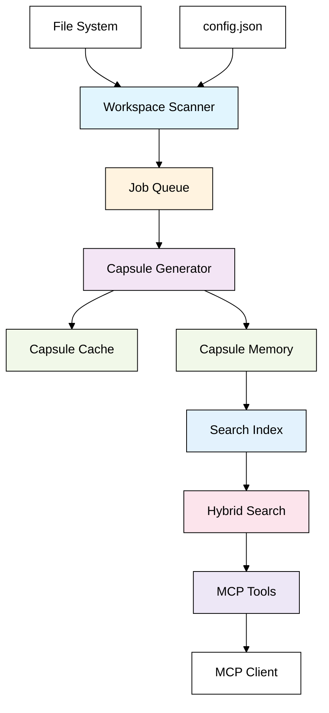
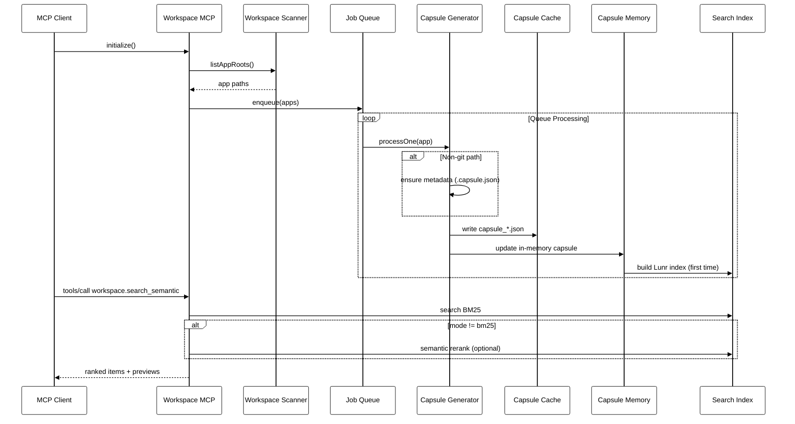
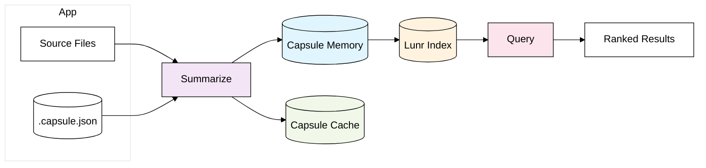

## Workspace MCP: Workflows, Caching, and Tooling

This document explains, in depth, how the server discovers apps, builds metadata, generates and caches capsules, and serves fast hybrid search, along with a detailed reference for configuration and tools.

### High-Level Flow



### Why it’s fast: Metadata → Capsules → Cache → Search

- Metadata (`.capsule.json`) is created only for non-git directories as a lightweight description and indexing intent.
- Capsule = a compact JSON summary per app with purpose, entrypoints, key modules, docs, tests.
- Capsule Cache = persisted capsules on disk (`cache/capsule_*.json`) so repeated queries skip recomputation.
- Search Index = per-app Lunr index derived from files; built once and reused.
- Hybrid Search = BM25 + optional semantic reranking; narrows to relevant files quickly.

### Detailed Sequence



### Boot Sequence (From Zero → Ready)

```mermaid
%%{init: {"theme": "base", "themeVariables": {"primaryColor": "#ffffff", "primaryTextColor": "#000000", "primaryBorderColor": "#000000", "lineColor": "#000000", "background": "#ffffff"}} }%%
graph LR
  Start([Start]) --> ReadCfg[Read config.json]
  ReadCfg --> Discover[listAppRoots()]
  Discover --> Enqueue[Seed jobs for apps]
  Enqueue --> Pump[pumpQueue()]
  Pump --> Proc[processOne(app)]
  Proc -->|non-git| Meta[ensure .capsule.json]
  Proc --> Summ[Summarize app]
  Summ --> Cache[Write capsule cache]
  Summ --> Mem[Update in-memory capsule]
  Mem --> Lunr[Build Lunr index]
  Lunr --> Watch[Start file watchers]
  Watch --> Ready([Ready])

  style ReadCfg fill:#e1f5fe,color:#000,stroke:#000
  style Discover fill:#e1f5fe,color:#000,stroke:#000
  style Enqueue fill:#fff3e0,color:#000,stroke:#000
  style Pump fill:#fff3e0,color:#000,stroke:#000
  style Proc fill:#ede7f6,color:#000,stroke:#000
  style Meta fill:#f1f8e9,color:#000,stroke:#000
  style Summ fill:#f3e5f5,color:#000,stroke:#000
  style Cache fill:#f1f8e9,color:#000,stroke:#000
  style Mem fill:#e1f5fe,color:#000,stroke:#000
  style Lunr fill:#e3f2fd,color:#000,stroke:#000
  style Watch fill:#fce4ec,color:#000,stroke:#000
```

Summary of relationships:
- The scanner discovers app roots using `appGlobs` and `ignore`.
- Each app becomes a capsule job; jobs are rate-limited and prioritized.
- Non-Git apps get a `.capsule.json` metadata file to guide indexing.
- Summaries populate the in-memory capsule and persist to the cache.
- The first time an app is seen, a Lunr index is built and reused.
- Watchers debounce file changes and enqueue incremental updates.

---

## Configuration Reference

`config.json` keys and impact:

- **workspaceRoot**: absolute path boundary for all operations; paths are validated to stay inside this root.
- **appGlobs**: patterns used by the scanner to discover app roots. Each discovered app becomes a unit for capsule building and indexing.
- **ignore**: `picomatch` patterns excluded everywhere (scanner, indexer, watchers).
- **queue**:
  - `maxConcurrentSummaries`: number of parallel capsule jobs.
  - `summariesPerMinute`: drip rate to avoid spikes.
  - `debounceMs`: coalesce file events before enqueue.
  - `priorityPaths`: any app path starting with these receives higher priority.
- **purpose**:
  - `limits`: default budgets for non-git apps (maxFiles, maxBytes, timeout).
  - `gitRepoOverrides`: larger budgets when inside a Git repo.
- **activity**:
  - `enable`: if true, promotes recently active subtrees.
  - `sources`: `cursorIde`, `cursorSessions`, `fsMtime` control which signals are used.
  - `promote`: thresholds controlling promotion density.

---

## Tooling Reference (MCP)

All tools are registered under the `workspace.*` namespace:

- `workspace.list_roots` → returns discovered app roots
- `workspace.list_apps` → returns apps with built capsules in memory
- `workspace.find_app(name, limit)` → fuzzy match app by name/rel path
- `workspace.bootstrap(app, intent?, force?)` → build or refresh capsule for `app` (uses cache when available)
- `workspace.list_entrypoints(app)` → list detected entrypoints for `app`
- `workspace.describe_symbol(path)` → file head and top-level definitions (safe for large files)
- `workspace.tests_for(app?)` → hot test files for the app (if any)
- `workspace.owners(path?)` → placeholder ownership info
- `workspace.search_semantic(query, app?, top_k?, min_score?, mode?)` → hybrid/BM25/semantic search

Search modes:
- `bm25` → keyword only
- `semantic` → embeddings only
- `hybrid` (default) → `score = 0.7 * semantic + 0.3 * bm25`

---

## Caching & Persistence

- Capsules are persisted to `cache/capsule_<hex(appPath)>.json`.
- On startup, the server enqueues existing apps and rebuilds capsules incrementally.
- When tools like `workspace.bootstrap` are called, the cache is checked first; only missing/stale pieces are recomputed.
- Telemetry is appended to `cache/telemetry.log` for troubleshooting.



---

## Git vs Non‑Git Apps and AI Summarization

### Behavior Summary

| Context | Metadata (.capsule.json) | Budgets Used | AI Summarization | Notes |
|---|---|---|---|---|
| Non‑Git app path | Created (once) | `purpose.limits` | Yes (local stub by default) | Guides indexing for non‑repo code |
| Git repo path | Not created | `purpose.gitRepoOverrides` | Yes (local stub by default) | Larger budgets for repos |

Key points:
- The system checks if an app is inside a Git repo to decide two things: whether to create lightweight metadata, and which resource budgets to apply.
- Both Git and non‑Git apps are summarized into capsules and cached.
- By default, external AI summarization is ENABLED. It can be disabled with env flags at any time.

Code references:

```58:116:/Users/ashafi/Documents/work/tools/workspace-mcp/index.js
const DEFAULT_WORKSPACE_ROOT = '/Users/ashafi/Documents/work';
...
async function aiSummarizeApp(appPath, limits) {
  // Minimal stub: collect small representative snippets; call no external model yet.
  // In your environment, wire to MCP sampling client here.
}
```

```147:166:/Users/ashafi/Documents/work/tools/workspace-mcp/index.js
const inGit = isInsideGitRepo(job.appPath);
const limits = inGit ? PURPOSE_LIMITS.gitRepoOverrides : PURPOSE_LIMITS.limits;
if (!inGit) { await ensureMetadataFile(job.appPath); }
// Summarize → write capsule cache → update in‑memory capsule
```

### Networking & Privacy

- External AI summarization is on by default. Disable via env (see below) if your policy requires fully local.
- If `WORKSPACE_MCP_AI_ENDPOINT` is set, it will POST representative snippets to that endpoint. Otherwise, if `OPENAI_API_KEY` is present, it will use OpenAI Chat Completions.
- If disabled or no provider is available, the system falls back to a local heuristic (no network calls).
- Telemetry is local (`cache/telemetry.log`).

### How to disable external AI

Set ONE of the following and restart:
```
export WORKSPACE_MCP_AI=disabled
# or
export WORKSPACE_MCP_AI_DISABLE=1
```

### How to configure external AI (default order: Gemini → OpenAI → local)

Option A: Gemini CLI (default priority)
```
export WORKSPACE_MCP_GEMINI_CLI=gemini           # or your wrapper
export WORKSPACE_MCP_GEMINI_MODEL=gemini-1.5-flash
export GOOGLE_API_KEY=your-gemini-api-key
# Optional custom args template (tokens: {MODEL}, {PROMPT})
# export WORKSPACE_MCP_GEMINI_ARGS="-m {MODEL} generate -p {PROMPT}"
```

Option B: OpenAI fallback
```
export OPENAI_API_KEY=sk-...
export WORKSPACE_MCP_AI_MODEL=gpt-4o-mini   # optional (default shown)
```

Option C: Generic HTTP endpoint (lowest priority)
```
export WORKSPACE_MCP_AI_ENDPOINT=https://your-ai-endpoint/summarize
export WORKSPACE_MCP_AI_AUTH="Bearer <TOKEN>"   # optional
```

---

## Operational Notes

- All file operations are constrained to `workspaceRoot`.
- Large files are summarized (head + signatures) to prevent heavy loads.
- Logs are not indexed by default.
- Activity promotion runs periodically when enabled.

---

## Example: End-to-End

1) Add the server in your MCP client (e.g., Cursor) with command:
```
node /path/to/workspace-mcp/index.js
```
2) Initialize config (first time):
```
npx workspace-mcp init
```
3) Start server:
```
npx workspace-mcp start
```
4) From your MCP client, call:
```
workspace.search_semantic("kubeVirt utils for Cypress")
```
→ The server reuses the capsule cache and Lunr index to return results quickly.


