## Workspace MCP: Workflows, Caching, and Tooling

This document explains, in depth, how the server discovers apps, builds metadata, generates and caches capsules, and serves fast hybrid search, along with a detailed reference for configuration and tools.

## 📁 App Discovery: What Constitutes an "App"

### 🔍 App Definition and Discovery Logic

An **"app"** in Workspace MCP is any directory that matches the configured `appGlobs` patterns and contains project-like structure. The system doesn't make assumptions about what constitutes a project - it relies on your configuration.

```mermaid
flowchart TB
    subgraph Config ["⚙️ Configuration"]
        AppGlobs["📋 appGlobs<br/>['apps/*', 'tools/*', 'automation/*']"]
        Ignore["🚫 ignore<br/>['node_modules', '.git', 'dist']"]
        WorkspaceRoot["📁 workspaceRoot<br/>'/path/to/your/workspace'"]
    end
    
    subgraph Discovery ["🔍 Discovery Process"]
        Scan["🔍 Scan Workspace<br/>📁 Read workspaceRoot<br/>🔍 Apply appGlobs patterns<br/>🚫 Filter by ignore patterns"]
        
        Match["📋 Pattern Matching<br/>✅ 'apps/my-service' matches 'apps/*'<br/>✅ 'tools/cli-tool' matches 'tools/*'<br/>❌ 'node_modules/lib' ignored"]
        
        Validate["✔️ Validation<br/>📁 Must be directory<br/>📂 Must be readable<br/>🔍 Must exist on filesystem"]
    end
    
    subgraph Result ["📋 App Registry"]
        AppList["📝 Discovered Apps<br/>• /workspace/apps/auth-service<br/>• /workspace/apps/payment-api<br/>• /workspace/tools/cli-helper<br/>• /workspace/automation/scripts"]
    end
    
    Config --> Discovery
    Scan --> Match
    Match --> Validate
    Validate --> AppList
    
    classDef config fill:#e3f2fd,stroke:#2196f3,stroke-width:2px,color:#000
    classDef discovery fill:#fff3e0,stroke:#ff9800,stroke-width:2px,color:#000
    classDef result fill:#e8f5e8,stroke:#4caf50,stroke-width:2px,color:#000

    class AppGlobs,Ignore,WorkspaceRoot config
    class Scan,Match,Validate discovery
    class AppList result
```

### 📋 App Discovery Examples

| appGlobs Pattern | Workspace Structure | Discovered Apps | Notes |
|------------------|---------------------|-----------------|-------|
| `"apps/*"` | `/workspace/apps/auth/`<br/>`/workspace/apps/payment/` | 2 apps:<br/>• `auth`<br/>• `payment` | Each subdirectory becomes an app |
| `"tools/*"` | `/workspace/tools/cli/`<br/>`/workspace/tools/scripts/` | 2 apps:<br/>• `cli`<br/>• `scripts` | Tools are treated as individual apps |
| `"automation"` | `/workspace/automation/` | 1 app:<br/>• `automation` | Entire directory is one app |
| `"*"` | `/workspace/projectA/`<br/>`/workspace/projectB/` | 2 apps:<br/>• `projectA`<br/>• `projectB` | Top-level scan (fallback) |

### 🏗️ What Makes a Directory an "App"

The system considers any directory an "app" if:

1. **✅ Matches `appGlobs` pattern** - Defined in your configuration
2. **✅ Not in `ignore` list** - Excludes `node_modules`, `.git`, etc.
3. **✅ Is a directory** - Files are not considered apps
4. **✅ Is readable** - System has filesystem access

**Important**: The system does NOT require:
- `package.json` or other project files
- Specific folder structure (`src/`, `tests/`)
- README or documentation
- Any particular programming language

### 🔄 App Lifecycle: From Discovery to Ready

```mermaid
flowchart LR
    Discover["🔍 Discovery<br/>📋 Match appGlobs<br/>🚫 Apply ignore filters<br/>✔️ Validate existence"]
    --> Enqueue["📋 Enqueue<br/>📊 Calculate priority<br/>⏱️ Add to job queue<br/>🚦 Rate limit"]
    --> Process["🏭 Process<br/>🔍 Check if Git repo<br/>📝 Create metadata (non-Git)<br/>🧠 AI analysis<br/>💾 Build capsule"]
    --> Cache["💾 Cache<br/>💾 Write to disk<br/>🧠 Load to memory<br/>📇 Build search index"]
    --> Ready["✅ Ready<br/>🔍 Available for search<br/>🛠️ Exposed via MCP tools<br/>👁️ Watched for changes"]
    
    classDef discover fill:#e3f2fd,stroke:#2196f3,stroke-width:2px,color:#000
    classDef queue fill:#fff3e0,stroke:#ff9800,stroke-width:2px,color:#000
    classDef process fill:#f3e5f5,stroke:#9c27b0,stroke-width:2px,color:#000
    classDef cache fill:#f1f8e9,stroke:#795548,stroke-width:2px,color:#000
    classDef ready fill:#e8f5e8,stroke:#4caf50,stroke-width:2px,color:#000

    class Discover discover
    class Enqueue queue
    class Process process
    class Cache cache
    class Ready ready
```

**Key Point**: An "app" is simply **any directory your configuration tells the system to analyze**. The intelligence comes from how the system processes and understands each discovered directory.

### 💻 Code Implementation: How Apps Are Discovered

```javascript
// From index.js: listAppRoots() function
function listAppRoots() {
  const results = new Set();
  for (const pattern of config.appGlobs || []) {
    const matches = fg.sync(pattern, { 
      cwd: WORKSPACE_ROOT, 
      onlyDirectories: true, 
      absolute: true, 
      dot: true, 
      ignore: config.ignore || [] 
    });
    for (const m of matches) results.add(m);
  }
  return Array.from(results);
}
```

**What this code does:**
1. **Iterates** through each pattern in `config.appGlobs`
2. **Uses fast-glob** to find matching directories
3. **Applies ignore filters** to exclude unwanted paths
4. **Returns absolute paths** of all discovered apps
5. **Deduplicates** if multiple patterns match the same directory

### 🔄 When Apps Are "Created" (Processed)

Apps are **discovered once** but **processed multiple times**:

| Event | Trigger | Action | AI Usage |
|-------|---------|--------|----------|
| **🚀 Server Startup** | Initial scan | Discover + enqueue all apps | ✅ AI analysis |
| **📝 File Changes** | Chokidar file watcher | Re-enqueue changed app | ✅ AI re-analysis |
| **📊 Activity Promotion** | Every 5 minutes | Enqueue active apps | ✅ AI analysis |
| **🔧 Manual Bootstrap** | `workspace.bootstrap` call | Force refresh specific app | ✅ AI analysis |
| **🔍 Search Query** | `workspace.search_semantic` | Use existing capsule | ❌ No AI |

### High-Level Flow

```mermaid
graph TB
    FileSystem["📁 File System"]
    Scanner["🔍 Workspace Scanner"]
    Config["⚙️ config.json"]
    Queue["📋 Job Queue"]
    Generator["🏭 Capsule Generator"]
    Cache["💾 Capsule Cache"]
    Memory["🧠 Capsule Memory"]
    Index["📇 Search Index"]
    Search["🔎 Hybrid Search"]
    Tools["🛠️ MCP Tools"]
    Client["💻 MCP Client"]

    FileSystem --> Scanner
    Config --> Scanner
    Scanner --> Queue
    Queue --> Generator
    Generator --> Cache
    Generator --> Memory
    Memory --> Index
    Index --> Search
    Search --> Tools
    Tools --> Client

    classDef scanner fill:#e1f5fe,stroke:#333,stroke-width:2px,color:#000
    classDef queue fill:#fff3e0,stroke:#333,stroke-width:2px,color:#000
    classDef generator fill:#f3e5f5,stroke:#333,stroke-width:2px,color:#000
    classDef storage fill:#f1f8e9,stroke:#333,stroke-width:2px,color:#000
    classDef search fill:#e3f2fd,stroke:#333,stroke-width:2px,color:#000
    classDef tools fill:#ede7f6,stroke:#333,stroke-width:2px,color:#000

    class Scanner scanner
    class Queue queue
    class Generator generator
    class Cache,Memory storage
    class Index,Search search
    class Tools tools
```

## 🧠 Capsule-Based Architecture: Optimizing AI Service Performance

### The Problem: Brute Force Workspace Scanning

Without MCP, AI services face this challenge every time:

```mermaid
flowchart TB
    subgraph Workspace ["📁 Raw Workspace (Thousands of Files)"]
        App1["📁 App 1<br/>├── src/ (50 files)<br/>├── tests/ (30 files)<br/>├── docs/ (10 files)<br/>└── ❓ Purpose unknown"]
        App2["📁 App 2<br/>├── components/ (200 files)<br/>├── utils/ (40 files)<br/>├── styles/ (60 files)<br/>└── ❓ Purpose unknown"]
        App3["📁 App 3<br/>├── modules/ (80 files)<br/>├── config/ (15 files)<br/>├── scripts/ (25 files)<br/>└── ❓ Purpose unknown"]
        AppN["📁 ... App N<br/>├── ❓ Unknown structure<br/>└── ❓ Unknown purpose"]
    end
    
    AI["🤖 AI Service"] --> Scan1["🔍 Scan App 1<br/>⏱️ Read 90 files<br/>🧠 Analyze purpose<br/>📝 Understand structure"]
    AI --> Scan2["🔍 Scan App 2<br/>⏱️ Read 300 files<br/>🧠 Analyze purpose<br/>📝 Understand structure"]
    AI --> Scan3["🔍 Scan App 3<br/>⏱️ Read 120 files<br/>🧠 Analyze purpose<br/>📝 Understand structure"]
    AI --> ScanN["🔍 Scan App N<br/>⏱️ Read ??? files<br/>🧠 Analyze purpose<br/>📝 Understand structure"]
    
    Scan1 --> Slow["🐌 SLOW RESULT<br/>⏱️ Minutes per query<br/>💸 High compute cost<br/>🔄 Repeated work"]
    Scan2 --> Slow
    Scan3 --> Slow
    ScanN --> Slow

    classDef workspace fill:#ffebee,stroke:#d32f2f,stroke-width:2px,color:#000
    classDef ai fill:#e3f2fd,stroke:#333,stroke-width:2px,color:#000
    classDef scan fill:#fff3e0,stroke:#ff9800,stroke-width:2px,color:#000
    classDef slow fill:#ffcdd2,stroke:#d32f2f,stroke-width:3px,color:#000

    class App1,App2,App3,AppN workspace
    class AI ai
    class Scan1,Scan2,Scan3,ScanN scan
    class Slow slow
```

### The Solution: Intelligent Capsule-Based Navigation

With MCP, AI services get a **pre-computed intelligence layer**:

```mermaid
flowchart TB
    subgraph MCP ["🧠 MCP Intelligence Layer"]
        direction TB
        
        subgraph Capsules ["📦 Smart Capsules (Pre-computed)"]
            Cap1["📦 App 1 Capsule<br/>🎯 Purpose: 'User authentication service'<br/>🚪 Entry: auth/main.py<br/>🧪 Tests: tests/auth/<br/>📚 Docs: docs/auth.md<br/>⚡ Ready to query"]
            
            Cap2["📦 App 2 Capsule<br/>🎯 Purpose: 'React UI components library'<br/>🚪 Entry: src/index.tsx<br/>🧪 Tests: __tests__/<br/>📚 Docs: README.md<br/>⚡ Ready to query"]
            
            Cap3["📦 App 3 Capsule<br/>🎯 Purpose: 'Payment processing API'<br/>🚪 Entry: server/app.js<br/>🧪 Tests: tests/integration/<br/>📚 Docs: docs/api.md<br/>⚡ Ready to query"]
        end
        
        subgraph Indexes ["📇 Search Indexes (Pre-built)"]
            Idx1["📇 App 1 Index<br/>🔍 BM25 + Semantic<br/>📊 Ranked relevance<br/>⚡ Instant lookup"]
            Idx2["📇 App 2 Index<br/>🔍 BM25 + Semantic<br/>📊 Ranked relevance<br/>⚡ Instant lookup"]
            Idx3["📇 App 3 Index<br/>🔍 BM25 + Semantic<br/>📊 Ranked relevance<br/>⚡ Instant lookup"]
        end
    end
    
    AI["🤖 AI Service"] --> Smart["🧠 Smart Query:<br/>'Where is user authentication?'"]
    Smart --> Cap1
    Cap1 --> Target["🎯 Direct to: auth/main.py<br/>⚡ Instant result<br/>📊 High confidence<br/>🎯 Precise targeting"]
    
    AI2["🤖 AI Service"] --> Smart2["🧠 Smart Query:<br/>'How does payment work?'"]
    Smart2 --> Cap3
    Cap3 --> Target2["🎯 Direct to: server/app.js<br/>⚡ Instant result<br/>📊 High confidence<br/>🎯 Precise targeting"]

    classDef capsule fill:#e8f5e8,stroke:#4caf50,stroke-width:2px,color:#000
    classDef index fill:#e3f2fd,stroke:#2196f3,stroke-width:2px,color:#000
    classDef ai fill:#fff3e0,stroke:#333,stroke-width:2px,color:#000
    classDef smart fill:#f3e5f5,stroke:#9c27b0,stroke-width:2px,color:#000
    classDef target fill:#e8f5e8,stroke:#4caf50,stroke-width:3px,color:#000

    class Cap1,Cap2,Cap3 capsule
    class Idx1,Idx2,Idx3 index
    class AI,AI2 ai
    class Smart,Smart2 smart
    class Target,Target2 target
```

**Key Insight**: Instead of scanning thousands of files every time, the AI service navigates through **intelligent capsules** that already know each app's purpose, structure, and key files.

## 🗂️ Hierarchical Navigation: From Concept to File

### How AI Services Navigate the Workspace Hierarchy

```mermaid
flowchart LR
    subgraph Query ["🔍 AI Query Process"]
        Q["🤖 AI Query:<br/>'Where is authentication handled?'"]
    end
    
    subgraph Level1 ["🌟 Level 1: Capsule Discovery"]
        C1["📦 Auth Service<br/>🎯 Purpose: 'User authentication'<br/>⭐ Relevance: 95%"]
        C2["📦 UI Components<br/>🎯 Purpose: 'React components'<br/>⭐ Relevance: 15%"]
        C3["📦 Payment API<br/>🎯 Purpose: 'Payment processing'<br/>⭐ Relevance: 5%"]
    end
    
    subgraph Level2 ["📂 Level 2: Structure Navigation"]
        S1["🚪 Entrypoints:<br/>• auth/main.py<br/>• auth/middleware.py"]
        S2["🧪 Tests:<br/>• tests/auth/test_login.py<br/>• tests/auth/test_tokens.py"]
        S3["📚 Docs:<br/>• docs/authentication.md<br/>• README.md"]
    end
    
    subgraph Level3 ["📄 Level 3: File Targeting"]
        F1["📄 auth/main.py<br/>🎯 Primary authentication logic<br/>📊 Semantic score: 0.92<br/>🔍 BM25 score: 0.88"]
        F2["📄 auth/middleware.py<br/>🎯 Auth middleware functions<br/>📊 Semantic score: 0.85<br/>🔍 BM25 score: 0.82"]
    end
    
    Q --> C1
    Q -.-> C2
    Q -.-> C3
    C1 --> S1
    C1 --> S2
    C1 --> S3
    S1 --> F1
    S1 --> F2
    
    classDef query fill:#e3f2fd,stroke:#2196f3,stroke-width:3px,color:#000
    classDef relevant fill:#e8f5e8,stroke:#4caf50,stroke-width:3px,color:#000
    classDef irrelevant fill:#f5f5f5,stroke:#9e9e9e,stroke-width:1px,color:#666
    classDef structure fill:#fff3e0,stroke:#ff9800,stroke-width:2px,color:#000
    classDef file fill:#f3e5f5,stroke:#9c27b0,stroke-width:2px,color:#000

    class Q query
    class C1 relevant
    class C2,C3 irrelevant
    class S1,S2,S3 structure
    class F1,F2 file
```

### Performance Comparison: Brute Force vs Intelligent Navigation

| Approach | Files Scanned | Time | Accuracy | Cache Benefit |
|----------|---------------|------|----------|---------------|
| **🐌 Brute Force** | 1,000+ files | 30-60 seconds | Variable | None |
| **🧠 MCP Capsules** | 5-10 files | 0.5-2 seconds | High | 95%+ cache hit |

### The Caching Workflow in Detail

```mermaid
flowchart TB
    subgraph Bootstrap ["🚀 Bootstrap Phase (Once per App)"]
        direction TB
        
        Discover["🔍 Discover App<br/>📁 /workspace/auth-service"]
        --> Analyze["🧠 AI Analysis<br/>📄 Scan representative files<br/>🎯 Extract purpose<br/>📊 Classify role"]
        --> Build["🏭 Build Capsule<br/>📝 Metadata extraction<br/>🚪 Find entrypoints<br/>🧪 Locate tests<br/>📚 Index docs"]
        --> Cache["💾 Cache to Disk<br/>💾 cache/capsule_auth.json<br/>🧠 Load to memory<br/>📇 Build search index"]
    end
    
    subgraph Runtime ["⚡ Runtime Phase (Every Query)"]
        direction TB
        
        AIQuery["🤖 AI Query<br/>'authentication logic'"]
        --> CacheCheck["🔍 Cache Lookup<br/>⚡ 0.001s lookup<br/>📦 Load capsule<br/>📇 Use search index"]
        --> SmartFilter["🧠 Smart Filtering<br/>🎯 Purpose matching<br/>📊 Relevance scoring<br/>🔍 Semantic ranking"]
        --> DirectTarget["🎯 Direct Targeting<br/>📄 auth/main.py<br/>📄 auth/middleware.py<br/>⚡ 0.1s total time"]
    end
    
    Cache -.-> CacheCheck
    
    classDef bootstrap fill:#fff3e0,stroke:#ff9800,stroke-width:2px,color:#000
    classDef runtime fill:#e8f5e8,stroke:#4caf50,stroke-width:2px,color:#000
    classDef cache fill:#f1f8e9,stroke:#795548,stroke-width:2px,color:#000
    classDef target fill:#e8f5e8,stroke:#4caf50,stroke-width:3px,color:#000

    class Discover,Analyze,Build bootstrap
    class AIQuery,CacheCheck,SmartFilter runtime
    class Cache cache
    class DirectTarget target
```

## 📊 Capsule Metadata: The Intelligence Behind Fast Queries

### What's Inside a Capsule (Real Example)

```mermaid
flowchart LR
    subgraph CapsuleFile ["💾 cache/capsule_auth_service.json"]
        direction TB
        
        subgraph Meta ["📋 Core Metadata"]
            Purpose["🎯 Purpose<br/>'User authentication and session management'"]
            Generated["📅 Generated<br/>'2024-09-10T12:34:56Z'"]
            Budget["💰 Token Budget<br/>1200 tokens"]
        end
        
        subgraph Structure ["🏗️ App Structure"]
            Entry["🚪 Entrypoints<br/>['auth/main.py', 'auth/cli.py']"]
            Modules["📦 Key Modules<br/>['auth/models.py', 'auth/utils.py']"]
            Tests["🧪 Hot Tests<br/>['tests/auth/test_login.py']"]
            Docs["📚 Documentation<br/>['docs/auth.md', 'README.md']"]
        end
        
        subgraph AI ["🤖 AI Analysis"]
            Role["🏷️ Role: 'authentication'"]
            Confidence["📊 Confidence: 0.85"]
            Evidence["📄 Evidence Paths<br/>['auth/main.py', 'auth/models.py']"]
        end
    end
    
    subgraph Usage ["🔍 How AI Uses This"]
        Query["🤖 Query: 'authentication'"]
        --> Match["🎯 Purpose Match: 95%"]
        --> Navigate["🧭 Navigate to Entrypoints"]
        --> Rank["📊 Rank by Confidence"]
        --> Result["⚡ Return: auth/main.py<br/>🕐 Total time: 0.1s"]
    end
    
    CapsuleFile -.-> Usage
    
    classDef metadata fill:#e3f2fd,stroke:#2196f3,stroke-width:2px,color:#000
    classDef structure fill:#fff3e0,stroke:#ff9800,stroke-width:2px,color:#000
    classDef ai fill:#f3e5f5,stroke:#9c27b0,stroke-width:2px,color:#000
    classDef usage fill:#e8f5e8,stroke:#4caf50,stroke-width:2px,color:#000

    class Meta,Purpose,Generated,Budget metadata
    class Structure,Entry,Modules,Tests,Docs structure
    class AI,Role,Confidence,Evidence ai
    class Query,Match,Navigate,Rank,Result usage
```

### Cache Hit vs Cache Miss: The Performance Impact

```mermaid
flowchart LR
    subgraph CacheHit ["✅ Cache Hit (95% of queries)"]
        direction TB
        QH["🤖 AI Query"]
        --> LoadH["📦 Load Capsule<br/>⚡ 0.001s"]
        --> SearchH["🔍 Search Index<br/>⚡ 0.05s"]
        --> ResultH["🎯 Result<br/>⚡ 0.1s total"]
    end
    
    subgraph CacheMiss ["❌ Cache Miss (5% of queries)"]
        direction TB
        QM["🤖 AI Query"]
        --> ScanM["🔍 Full Scan<br/>⏱️ 2-5s"]
        --> AnalyzeM["🧠 AI Analysis<br/>⏱️ 3-10s"]
        --> BuildM["🏭 Build Capsule<br/>⏱️ 1-2s"]
        --> CacheM["💾 Cache Result<br/>⏱️ 0.1s"]
        --> ResultM["🎯 Result<br/>⏱️ 6-17s total"]
    end
    
    classDef hit fill:#e8f5e8,stroke:#4caf50,stroke-width:2px,color:#000
    classDef miss fill:#ffebee,stroke:#f44336,stroke-width:2px,color:#000
    classDef fast fill:#e8f5e8,stroke:#4caf50,stroke-width:3px,color:#000
    classDef slow fill:#ffcdd2,stroke:#f44336,stroke-width:3px,color:#000

    class QH,LoadH,SearchH hit
    class QM,ScanM,AnalyzeM,BuildM,CacheM miss
    class ResultH fast
    class ResultM slow
```

### Detailed Sequence


### Boot Sequence (From Zero → Ready)

```mermaid
flowchart LR
    Start(["🚀 Start"]) --> ReadCfg["📖 Read config.json"]
    ReadCfg --> Discover["🔍 listAppRoots()"]
    Discover --> Enqueue["📋 Seed jobs for apps"]
    Enqueue --> Pump["⚡ pumpQueue()"]
    Pump --> Proc["🏭 processOne(app)"]
    Proc -->|non-git| Meta["📝 ensure .capsule.json"]
    Proc --> Summ["🧠 Summarize app"]
    Summ --> Cache["💾 Write capsule cache"]
    Summ --> Mem["🧠 Update in-memory capsule"]
    Mem --> Lunr["📇 Build Lunr index"]
    Lunr --> Watch["👁️ Start file watchers"]
    Watch --> Ready(["✅ Ready"])

    classDef startEnd fill:#e8f5e8,stroke:#333,stroke-width:3px,color:#000
    classDef config fill:#e1f5fe,stroke:#333,stroke-width:2px,color:#000
    classDef queue fill:#fff3e0,stroke:#333,stroke-width:2px,color:#000
    classDef process fill:#ede7f6,stroke:#333,stroke-width:2px,color:#000
    classDef storage fill:#f1f8e9,stroke:#333,stroke-width:2px,color:#000
    classDef search fill:#e3f2fd,stroke:#333,stroke-width:2px,color:#000
    classDef watch fill:#fce4ec,stroke:#333,stroke-width:2px,color:#000

    class Start,Ready startEnd
    class ReadCfg,Discover config
    class Enqueue,Pump queue
    class Proc,Summ process
    class Meta,Cache,Mem storage
    class Lunr search
    class Watch watch
```

Summary of relationships:
- The scanner discovers app roots using `appGlobs` and `ignore`.
- Each app becomes a capsule job; jobs are rate-limited and prioritized.
- Non-Git apps get a `.capsule.json` metadata file to guide indexing.
- Summaries populate the in-memory capsule and persist to the cache.
- The first time an app is seen, a Lunr index is built and reused.
- Watchers debounce file changes and enqueue incremental updates.

---

## Configuration Reference

`config.json` keys and impact:

- **workspaceRoot**: absolute path boundary for all operations; paths are validated to stay inside this root.
- **appGlobs**: patterns used by the scanner to discover app roots. Each discovered app becomes a unit for capsule building and indexing.
- **ignore**: `picomatch` patterns excluded everywhere (scanner, indexer, watchers).
- **queue**:
  - `maxConcurrentSummaries`: number of parallel capsule jobs.
  - `summariesPerMinute`: drip rate to avoid spikes.
  - `debounceMs`: coalesce file events before enqueue.
  - `priorityPaths`: any app path starting with these receives higher priority.
- **purpose**:
  - `limits`: default budgets for non-git apps (maxFiles, maxBytes, timeout).
  - `gitRepoOverrides`: larger budgets when inside a Git repo.
- **activity**:
  - `enable`: if true, promotes recently active subtrees.
  - `sources`: `cursorIde`, `cursorSessions`, `fsMtime` control which signals are used.
  - `promote`: thresholds controlling promotion density.

---

## Tooling Reference (MCP)

All tools are registered under the `workspace.*` namespace:

- `workspace.list_roots` → returns discovered app roots
- `workspace.list_apps` → returns apps with built capsules in memory
- `workspace.find_app(name, limit)` → fuzzy match app by name/rel path
- `workspace.bootstrap(app, intent?, force?)` → build or refresh capsule for `app` (uses cache when available)
- `workspace.list_entrypoints(app)` → list detected entrypoints for `app`
- `workspace.describe_symbol(path)` → file head and top-level definitions (safe for large files)
- `workspace.tests_for(app?)` → hot test files for the app (if any)
- `workspace.owners(path?)` → placeholder ownership info
- `workspace.search_semantic(query, app?, top_k?, min_score?, mode?)` → hybrid/BM25/semantic search

Search modes:
- `bm25` → keyword only
- `semantic` → embeddings only
- `hybrid` (default) → `score = 0.7 * semantic + 0.3 * bm25`

---

## Caching & Persistence

- Capsules are persisted to `cache/capsule_<hex(appPath)>.json`.
- On startup, the server enqueues existing apps and rebuilds capsules incrementally.
- When tools like `workspace.bootstrap` are called, the cache is checked first; only missing/stale pieces are recomputed.
- Telemetry is appended to `cache/telemetry.log` for troubleshooting.


---

## 🔍 When AI Services Are Used vs Not Used: The Complete Guide

### 🧠 AI Usage Decision Tree

```mermaid
flowchart TB
    Start["🚀 App Processing Triggered"]
    --> CheckDisabled{"❌ AI Disabled?<br/>(WORKSPACE_MCP_AI=disabled)"}
    
    CheckDisabled -->|Yes| LocalOnly["🏠 Local Heuristic Only<br/>📝 Extract from README/package.json<br/>🚪 Find entrypoints<br/>🧪 Locate tests<br/>⚡ Fast, no network calls"]
    
    CheckDisabled -->|No| CheckGit{"📁 Git Repo?<br/>(has .git folder)"}
    
    CheckGit -->|Non-Git| NonGit["📝 Non-Git Path<br/>💾 Create .capsule.json<br/>📊 Use purpose.limits<br/>🧠 Try AI summarization"]
    
    CheckGit -->|Git Repo| GitRepo["📂 Git Repository<br/>❌ No .capsule.json<br/>📊 Use gitRepoOverrides<br/>🧠 Try AI summarization"]
    
    NonGit --> TryAI["🤖 Attempt AI Summarization"]
    GitRepo --> TryAI
    
    TryAI --> CheckAPI{"🔑 API Available?<br/>(GOOGLE_API_KEY or OPENAI_API_KEY)"}
    
    CheckAPI -->|Yes| AISuccess["✅ AI Summarization<br/>🧠 Gemini/OpenAI analysis<br/>🎯 Intelligent purpose extraction<br/>📊 Confidence scoring"]
    
    CheckAPI -->|No| AIFallback["🏠 Fallback to Local<br/>📝 Heuristic extraction<br/>🎯 Basic purpose from README<br/>📊 Lower confidence"]
    
    AISuccess --> CacheResult["💾 Cache Capsule<br/>💾 Write to cache/capsule_*.json<br/>🧠 Load to memory<br/>📇 Build search index"]
    
    AIFallback --> CacheResult
    LocalOnly --> CacheResult
    
    CacheResult --> Ready["✅ Ready for Queries"]

    classDef start fill:#e3f2fd,stroke:#2196f3,stroke-width:3px,color:#000
    classDef decision fill:#fff3e0,stroke:#ff9800,stroke-width:2px,color:#000
    classDef local fill:#f5f5f5,stroke:#9e9e9e,stroke-width:2px,color:#000
    classDef ai fill:#e8f5e8,stroke:#4caf50,stroke-width:2px,color:#000
    classDef cache fill:#f1f8e9,stroke:#795548,stroke-width:2px,color:#000
    classDef ready fill:#e8f5e8,stroke:#4caf50,stroke-width:3px,color:#000

    class Start start
    class CheckDisabled,CheckGit,CheckAPI decision
    class LocalOnly,AIFallback local
    class NonGit,GitRepo,TryAI,AISuccess ai
    class CacheResult cache
    class Ready ready
```

### 📊 Git vs Non-Git: Detailed Behavior Matrix

| Aspect | **Non-Git Projects** | **Git Repositories** |
|--------|---------------------|----------------------|
| **📝 Metadata File** | ✅ Creates `.capsule.json` | ❌ No metadata file |
| **🎯 Purpose** | Guide indexing for loose files | Assume repo has own structure |
| **📊 Resource Budgets** | `purpose.limits` (conservative) | `purpose.gitRepoOverrides` (generous) |
| **📁 Max Files** | 25 files | 50 files |
| **💾 Max Bytes** | 350KB | 800KB |
| **⏱️ Timeout** | 8 seconds | 12 seconds |
| **🧠 AI Summarization** | ✅ Yes (if enabled) | ✅ Yes (if enabled) |
| **🔄 Refresh Trigger** | File changes + activity | File changes + activity |

### 🔄 Capsule Refresh Mechanisms: When and How Often

```mermaid
flowchart TB
    subgraph Triggers ["⚡ Refresh Triggers"]
        FileChange["📝 File Changes<br/>🔍 Chokidar detects edits<br/>⏱️ 750ms debounce<br/>📋 Enqueues app"]
        
        Activity["📊 Activity Promotion<br/>👁️ Cursor IDE usage<br/>📂 Recent file access<br/>⏱️ Every 5 minutes<br/>📋 Promotes hot apps"]
        
        Startup["🚀 Server Startup<br/>💾 Load existing capsules<br/>📋 Enqueue all apps<br/>🔄 Incremental updates"]
        
        Manual["🔧 Manual Bootstrap<br/>🛠️ workspace.bootstrap tool<br/>🔄 Force refresh<br/>⚡ Immediate update"]
    end
    
    subgraph RateLimit ["🚦 Rate Limiting"]
        Queue["📋 Priority Queue<br/>🥇 Priority paths first<br/>📊 3 jobs/minute max<br/>⚡ 3 concurrent max"]
        
        Debounce["⏱️ Debouncing<br/>📁 Per-app 750ms window<br/>🔄 Coalesces rapid changes<br/>💾 Prevents spam"]
    end
    
    subgraph Processing ["🏭 Processing Pipeline"]
        Check["🔍 Check Cache<br/>💾 Load existing capsule<br/>📅 Check timestamps<br/>🔄 Decide if refresh needed"]
        
        Process["🧠 Process App<br/>🤖 Try AI (if enabled)<br/>🏠 Fallback to local<br/>💾 Update cache"]
    end
    
    FileChange --> Debounce
    Activity --> Queue
    Startup --> Queue
    Manual --> Queue
    
    Debounce --> Queue
    Queue --> Check
    Check --> Process
    
    classDef trigger fill:#fff3e0,stroke:#ff9800,stroke-width:2px,color:#000
    classDef rate fill:#e3f2fd,stroke:#2196f3,stroke-width:2px,color:#000
    classDef process fill:#f3e5f5,stroke:#9c27b0,stroke-width:2px,color:#000

    class FileChange,Activity,Startup,Manual trigger
    class Queue,Debounce rate
    class Check,Process process
```

### 🎯 Exact AI Service Usage Scenarios

#### ✅ **AI Services ARE Used When:**

1. **🧠 Capsule Creation/Refresh** (Both Git and Non-Git):
   ```javascript
   // Code reference: processOne() function
   const ai = await aiSummarizeApp(job.appPath, limits);
   capsule = Object.assign({}, summarizeApp(job.appPath), {
     purpose: ai.purpose || 'Unknown',
     ai: { role: ai.role, confidence: ai.confidence, evidence_paths: ai.evidence_paths }
   });
   ```
   - **When**: App first discovered, file changes detected, manual refresh
   - **What AI does**: Analyzes representative files to extract purpose and classify role
   - **Fallback**: If AI fails, uses local heuristic (`summarizeApp()`)

2. **🔄 Activity-Based Promotions**:
   - **Frequency**: Every 5 minutes (if `activity.enable: true`)
   - **Trigger**: Apps with activity score ≥ `minScore` (default 3.0)
   - **Sources**: Cursor IDE state, session history, recent file modifications

#### ❌ **AI Services are NOT Used When:**

1. **🚫 Explicitly Disabled**:
   ```bash
   export WORKSPACE_MCP_AI=disabled
   # or
   export WORKSPACE_MCP_AI_DISABLE=1
   ```

2. **🔍 Query-Time Operations**:
   - **Search queries** (`workspace.search_semantic`) use pre-built capsules
   - **Tool calls** (`list_entrypoints`, `describe_symbol`) use cached data
   - **No real-time AI** during user interactions

3. **💾 Cache Hits**:
   - If capsule already exists and is recent, AI is skipped
   - Uses cached `purpose`, `role`, `confidence` from previous AI analysis

### ⏰ Refresh Frequency by Scenario

| Scenario | Frequency | AI Usage | Cache Behavior |
|----------|-----------|----------|----------------|
| **🆕 New App** | Immediate | ✅ AI analysis | 💾 Create new capsule |
| **📝 File Changes** | 750ms debounced | ✅ AI re-analysis | 🔄 Update existing capsule |
| **📊 Activity Promotion** | Every 5 minutes | ✅ AI analysis | 🔄 Refresh if stale |
| **🔍 Search Queries** | Every query | ❌ No AI | 📖 Read cached capsule |
| **🛠️ Tool Calls** | Per call | ❌ No AI | 📖 Read cached capsule |

### 🔑 What "AI Service Available" Means

When AI services are available and used:

```mermaid
flowchart LR
    subgraph Available ["✅ AI Service Available"]
        API["🔑 API Key Present<br/>(GOOGLE_API_KEY or OPENAI_API_KEY)"]
        --> Call["📞 API Call<br/>📄 Send representative snippets<br/>🧠 Get intelligent analysis"]
        --> Parse["📝 Parse Response<br/>🎯 Extract purpose<br/>📊 Assign confidence<br/>🏷️ Classify role"]
        --> AIGenerated["🌟 AI-Generated Capsule<br/>🎯 AI-generated purpose<br/>📊 Confidence: 0.8-0.9<br/>📄 Evidence paths"]
    end
    
    subgraph Unavailable ["❌ AI Service Unavailable"]
        NoAPI["🚫 No API Key"]
        --> Heuristic["🏠 Local Heuristic<br/>📝 Parse README.md<br/>📦 Check package.json<br/>📚 Scan docs/ folder"]
        --> Basic["📦 Basic Capsule<br/>🎯 Heuristic purpose<br/>📊 Confidence: 0.6<br/>📄 File-based evidence"]
    end
    
    classDef available fill:#e8f5e8,stroke:#4caf50,stroke-width:2px,color:#000
    classDef unavailable fill:#fff3e0,stroke:#ff9800,stroke-width:2px,color:#000
    classDef aigenerated fill:#e8f5e8,stroke:#4caf50,stroke-width:3px,color:#000
    classDef basic fill:#f5f5f5,stroke:#9e9e9e,stroke-width:2px,color:#000

    class API,Call,Parse available
    class NoAPI,Heuristic unavailable
    class AIGenerated aigenerated
    class Basic basic
```

Code references:

```58:116:/Users/ashafi/Documents/work/tools/workspace-mcp/index.js
const DEFAULT_WORKSPACE_ROOT = '/Users/ashafi/Documents/work';
...
async function aiSummarizeApp(appPath, limits) {
  // Minimal stub: collect small representative snippets; call no external model yet.
  // In your environment, wire to MCP sampling client here.
}
```

```147:166:/Users/ashafi/Documents/work/tools/workspace-mcp/index.js
const inGit = isInsideGitRepo(job.appPath);
const limits = inGit ? PURPOSE_LIMITS.gitRepoOverrides : PURPOSE_LIMITS.limits;
if (!inGit) { await ensureMetadataFile(job.appPath); }
// Summarize → write capsule cache → update in‑memory capsule
```

### Networking & Privacy

- External AI summarization is on by default. Disable via env (see below) if your policy requires fully local.
- If `WORKSPACE_MCP_AI_ENDPOINT` is set, it will POST representative snippets to that endpoint. Otherwise, if `OPENAI_API_KEY` is present, it will use OpenAI Chat Completions.
- If disabled or no provider is available, the system falls back to a local heuristic (no network calls).
- Telemetry is local (`cache/telemetry.log`).

### How to disable external AI

Set ONE of the following and restart:
```
export WORKSPACE_MCP_AI=disabled
# or
export WORKSPACE_MCP_AI_DISABLE=1
```

### How to configure external AI (default order: Gemini → OpenAI → local)

Option A: Gemini CLI (default priority)
```
export WORKSPACE_MCP_GEMINI_CLI=gemini           # or your wrapper
export WORKSPACE_MCP_GEMINI_MODEL=gemini-1.5-flash
export GOOGLE_API_KEY=your-gemini-api-key
# Optional custom args template (tokens: {MODEL}, {PROMPT})
# export WORKSPACE_MCP_GEMINI_ARGS="-m {MODEL} generate -p {PROMPT}"
```

Option B: OpenAI fallback
```
export OPENAI_API_KEY=sk-...
export WORKSPACE_MCP_AI_MODEL=gpt-4o-mini   # optional (default shown)
```

Option C: Generic HTTP endpoint (lowest priority)
```
export WORKSPACE_MCP_AI_ENDPOINT=https://your-ai-endpoint/summarize
export WORKSPACE_MCP_AI_AUTH="Bearer <TOKEN>"   # optional
```

---

## Operational Notes

- All file operations are constrained to `workspaceRoot`.
- Large files are summarized (head + signatures) to prevent heavy loads.
- Logs are not indexed by default.
- Activity promotion runs periodically when enabled.

---

## Example: End-to-End

1) Add the server in your MCP client (e.g., Cursor) with command:
```
node /path/to/workspace-mcp/index.js
```
2) Initialize config (first time):
```
npx workspace-mcp init
```
3) Start server:
```
npx workspace-mcp start
```
4) From your MCP client, call:
```
workspace.search_semantic("kubeVirt utils for Cypress")
```
→ The server reuses the capsule cache and Lunr index to return results quickly.


